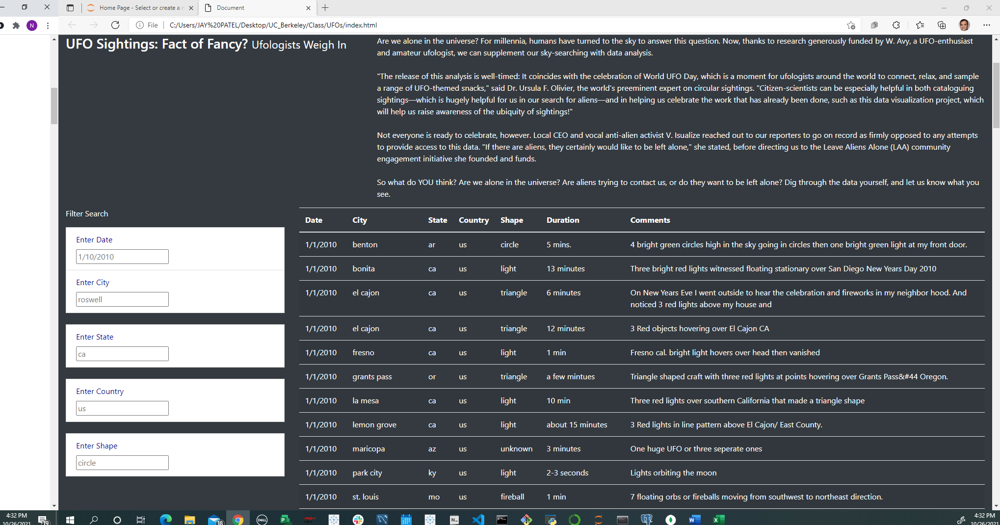

## Project Name: UFOs sightings indepth analysis

## Project Sponsor: NASAA

## Project Overview: 

Webpage with dynamic tables allowing users to filter multiple criteria like city, state, country and shape.

## Project Deliverables:

Deliverable 1: Filter UFO sightings on multiple criteria

Deliverable 2: A written report on the UFO analysis 

In this report we see that how exciting is to see how a table using data stored in a JavaScript array and creating filters to make this table fully dynamic, which will react to user input, and then place the table into an HTML file for easy viewing.

Also customizing webpage using Bootstrap, storyboarding  and table with several fully functional filters that will allow users to interact with our visualizations. 

There are a lot of objects, though, which will make the table huge! There will be hundreds of rows of sightings in the table, which is entirely too much for one person to reasonably look through and study. Adding the ability to filter the data Using D3.js is best way to add interractive functionality.

Now you can see table with filters which includes date, city, state, country and shape with comments

## Summary:
"The release of this analysis is well-timed: It coincides with the celebration of World UFO Day, which is a moment for ufologists around the world to connect, relax, and sample a range of UFO-themed snacks," said Dr. Ursula F. Olivier, the world's preeminent expert on circular sightings. "Citizen-scientists can be especially helpful in both cataloguing sightings—which is hugely helpful for us in our search for aliens—and in helping us celebrate the work that has already been done, such as this data visualization project, which will help us raise awareness of the ubiquity of sightings!"

UFOs have long been an object of fascination in the United States and abroad, and that obsession was fueled in 2017

